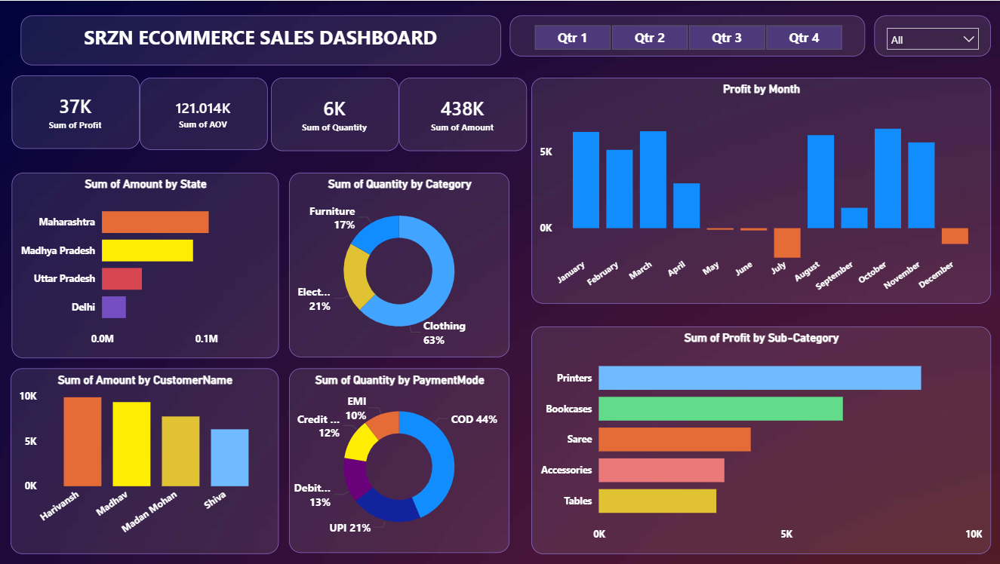
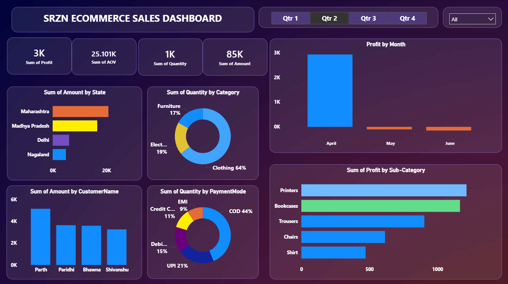

# 📊 SRZN E-Commerce Sales Dashboard

A **Power BI interactive dashboard** built to analyze e-commerce sales performance, customer behavior, and product profitability.  
This project demonstrates **data analysis, business intelligence, and dashboard design skills** using Power BI.

---

## 📌 Project Overview
The **SRZN E-Commerce Sales Dashboard** provides insights into sales, profit, quantity sold, and customer purchasing behavior.  
It helps businesses track **revenue trends, top performing products, and payment preferences** to support better decision-making.

---

## 🛠 Tools & Technologies
- Power BI
- Microsoft Excel / CSV
- Data Visualization
- Business Intelligence
- Data Analysis

---

## 📂 Dataset
The dataset used in this project includes:

- **Orders.csv** – Contains order details, customers, categories, and payment modes  
- **Details.csv** – Includes product information and sales metrics

---

## 📊 Dashboard Features

### Key Business Metrics
- Total Profit
- Average Order Value (AOV)
- Total Quantity Sold
- Total Sales Amount

### Sales Analysis
- Profit by Month to analyze monthly performance
- Sales by State to identify top performing regions
- Sales by Customer to track key buyers

### Product Insights
- Category distribution (Clothing, Electronics, Furniture)
- Profit analysis by sub-category (Printers, Phones, Accessories, etc.)

### Payment Analysis
Breakdown of payment modes:
- COD
- UPI
- EMI
- Debit Card
- Credit Card

### Interactive Filters
Users can filter dashboard insights by:
- Quarter (Q1 – Q4)

---

## 📷 Dashboard Preview

### Main Dashboard

### Additional View

---

## 📈 Key Insights
- Clothing category contributes the highest share of sales
- COD is the most used payment method
- Printers generate the highest profit among sub-categories
- Sales performance varies across states

---

---

## 🚀 How to Use
1. Download or clone the repository
2. Open the `.pbix` file in **Power BI Desktop**
3. Explore the interactive dashboard

---

## 👤 Author

**Srijan Rana**

MBA Student | Business & Data Analytics Enthusiast  
Skilled in Power BI, Excel, Business Analysis, and Dashboard Development

---

⭐ If you like this project, consider **starring the repository**.
